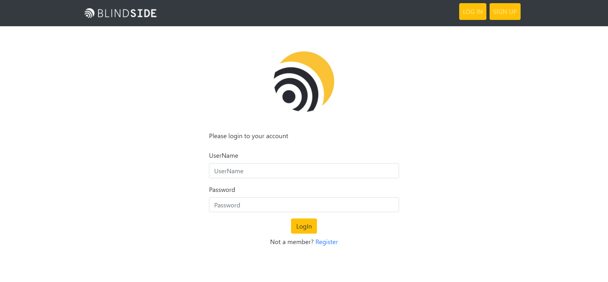
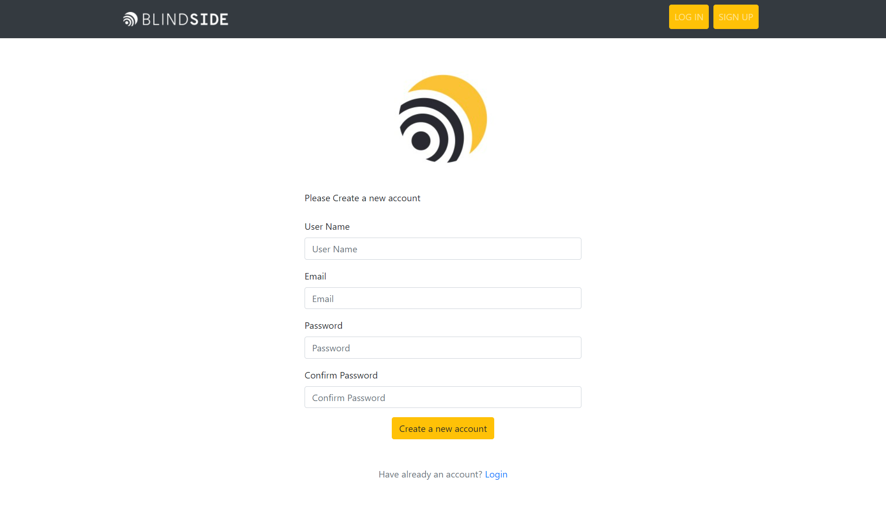
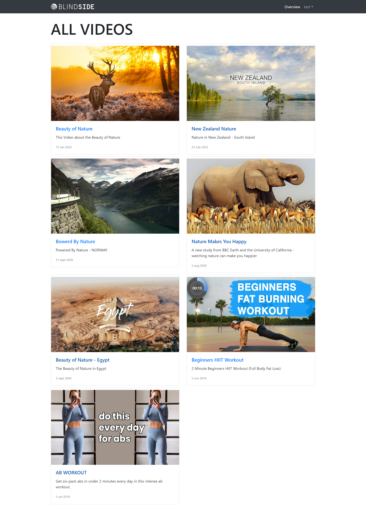
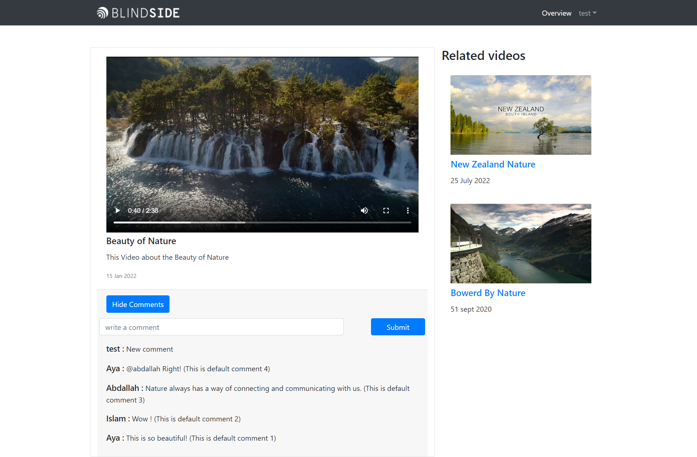

# BlindSide Internship Task Project. Aya Mohamed.

    

## Pages & Features

- Login page to authenticate and login.
- Register page to register new users.
- Overview page to show all videos on the website. 
- Video Item page
    - We can show/hide comments (comments are shown by default)
    - We can add new comments (new comments won't be stored)
    - We can see the related videos in the right side section.
        - The videos share the same category, we can see the category of each video in `src/data/videos.js`.
        - There are 3 categories:
            - `sport` it contains [`AB WORKOUT`,`Beginners HIIT Workout`] videos.
            - `nature` it contains [`Nature Makes You Happy`,`Beauty of Nature - Egypt`] videos.
            - `nature_sea` it contains [`Powered By Nature`,`New Zealand Nature`,`Beauty of Nature`] videos.
- Overview & Video Item pages are protected by Authentication Middleware.
    - We can register or use :
        - userName: `admin`
        - password: `admin`
    - Accounts and logged in user is stored in `localStorage`.

## Screennshots

Login                         | Register                         | Overview                         | Video Item                       |
:----------------------------:|:--------------------------------:|:--------------------------------:|:--------------------------------:|
  |   |   | |

## Steps to run the application

- Clone the repo `git clone https://github.com/ayaabuelsoud/browse-video-blindside.git`
- Open the folder of the repo `cd browse-video-blindside`
- Install dependencies `npm install`
- Run the app `npm start`
- Browse the app on `http://localhost:3000/`
